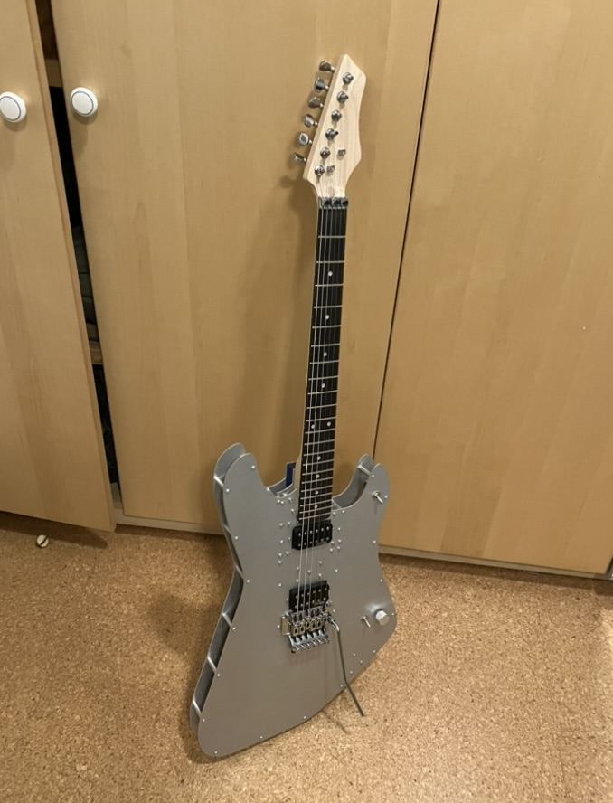
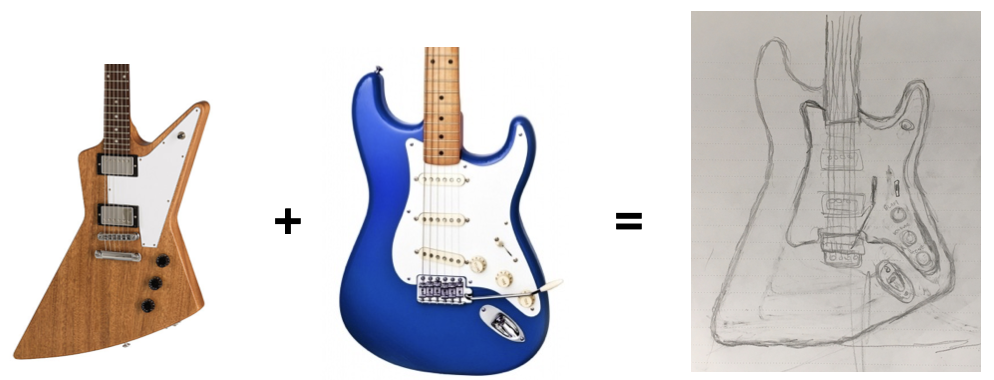
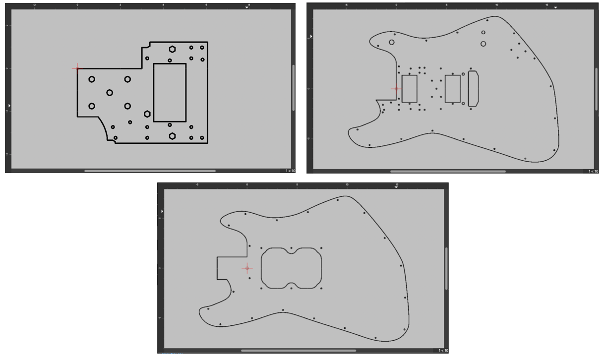

# Aluminum Guitar Body

|  |
| :--------------------------------------------------------------: |
|                The Completed Guitar                |

## Concept
I designed this guitar to combine the shapes of the Gibson Explorer and Fender Stratocaster designs.

|  |
| :--------------------------------------------------------------: |
|       Design Inspiration |

## Design

After prototyping in cardboard to ensure the design was ergonomic, I traced the above sketch into QCAD, an open-source 2D CAD program.
For the body design, I decided to use 3 aluminum plates. 

The electronics and the neck mounting plate are attached solely to the front plate, which makes repair easier. For the 3D CAD design, I used Autodesk Inventor.

|  |
| :--------------------------------------------------------------: |
|       The 3 plates that form the design |

The design consists of these 3 plates (rendered in QCAD). They are held together with 6-32 standoffs.

